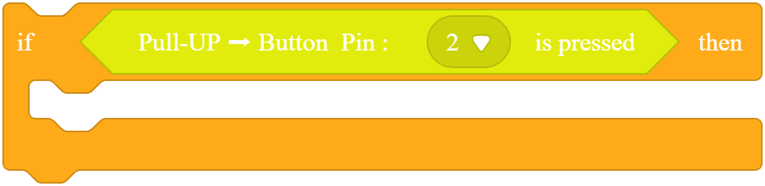
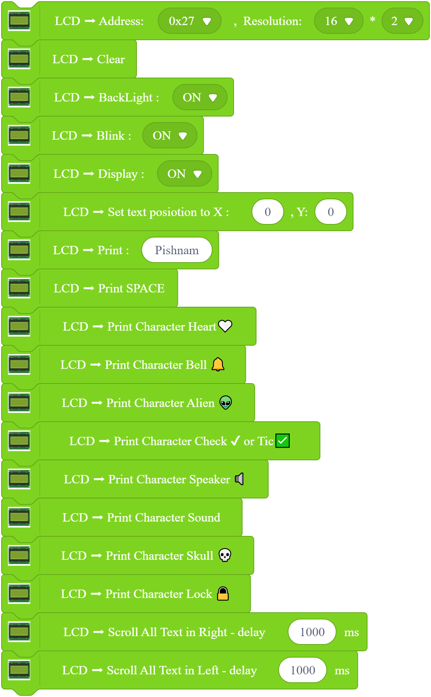
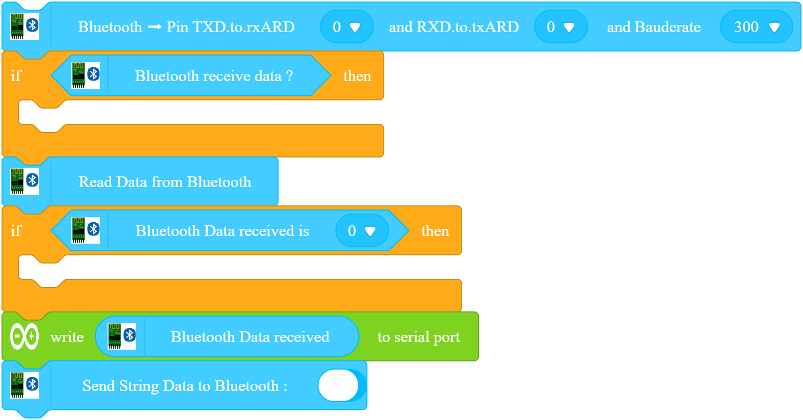
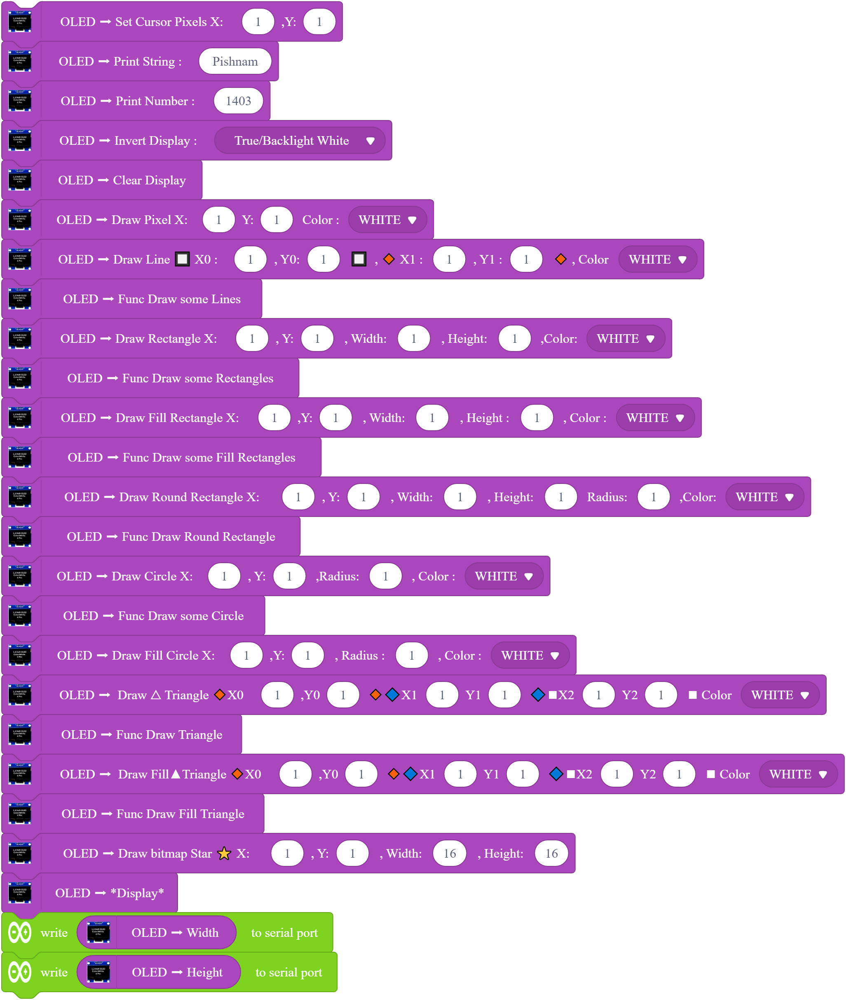
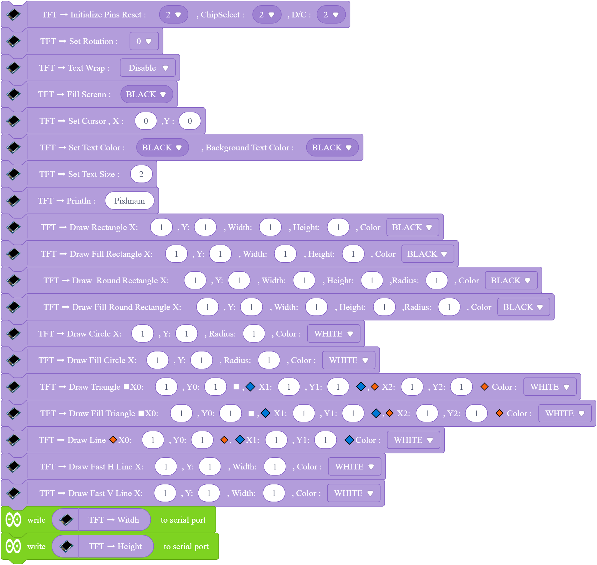

# Extension
 This is a **Arduino Uno Extension** for _MBlock Program_
 Open `MBlock.exe` and drag this `.mext` file Extension and Use it!
 And if you need to work with any module Check [Issues](https://github.com/Javatti/Extension/issues) or 
 

  

 
 |main|LCD|Bluetooth|OLED|TFT|
 |:-:|:-:|:-:|:-:|:-:|
 |OK✔|OK✔|OK✔|must be tested❔|must be tested❔|

  اگر دوست داشتی این اکستنشن را پس 

 

 # main
 
 # Lcd Character
 
 # Bluetooth Module 
 
 # OLED Disply
 
 # TFT Display
 

